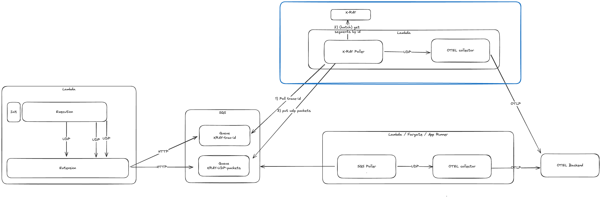
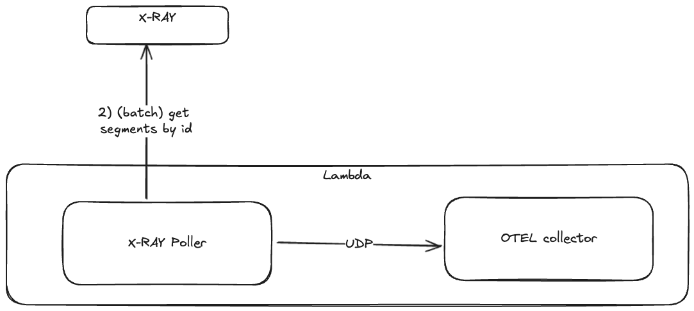

# AWS XRay to OpenTelemetry Bridge

This project is a bridge between AWS XRay and OpenTelemetry. It allows you to export traces from AWS XRay to OpenTelemetry.

## What is this project about?

This project is a Proof-of-Concept (PoC) to demonstrate how to export traces from AWS XRay to OpenTelemetry. It is a bridge that reads traces from AWS XRay and sends them to OpenTelemetry Collector.

The reason for the project is that currently there is a high penalty in regards of cold start time (600-800 ms added) when using OpenTelemetry (e.g. ADOT) in AWS Lambda. This is because OpenTelemetry requires a lot of dependencies to be loaded and initialized.

On the other hand AWS XRay is a service that is already integrated with AWS Lambda and an instrumentation with tools like Powertools for AWS Lambda is very easy to do.

Besides the cold start time the traces collected by AWS XRay have more information than the traces collected by OpenTelemetry. For example, AWS XRay traces have segments(spans in OpenTelemetry) that are including the AWS services itself like the AWS Lambda service interacting with the actual Lambda instance or fully managed services like the Api Gateway which only emit Xray traces/segments.

In the Opentelemetry world you only have segments starting on a sender and ending on a receiver. This means that you will not see the AWS Lambda service in the trace.

But doing observability with AWS XRay alone results in a vendor lock-in and limits you to the capabilities of AWS XRay. Alternative Observability solutions like Honeycomb, Dash0, Baselime, etc. do not support XRay traces natively. They only support OpenTelemetry.

By using this bridge, you can use AWS XRay to collect traces and send them to OpenTelemetry Collector, which can then be used to export traces to other systems.

## How it works

The bridge is pulling traces from AWS XRay using the AWS SDK.
The result is then sent via the UDP protocol to the OpenTelemetry Collector.
The Collector is running with the official XRay receiver.
This XRay receiver can receive traces/segments in XRay format and convert them to OpenTelemetry format.
Finally, the traces are sent to the configured backend using the collector exporter.

The bridge is triggered either periodically or by listening to messages on a SQS queue.

## Architecture Diagrams





## How to use it

### Prerequisites

- Docker
- Node.js
- AWS Account
- AWS CLI
- AWS SAM CLI

### Steps

1. Clone the repository

2. Install the dependencies

```bash
cd nodejs-example-telemetry-api-extension
npm install
```

3. Deploy example function

```bash
aws sam deploy
```

4. Set the SQS queue URL in the docker compose file `./otel-collector/docker-compose.yml`

5. Start the OpenTelemetry Collector

```bash
cd otel-collector
docker-compose up
```

6. Invoke the function

See the logs of the OpenTelemetry Collector to see the traces.
If you have an OpenTelemetry backend you can configure the exporter in the `otel-collector/collector-config.yaml` file.
